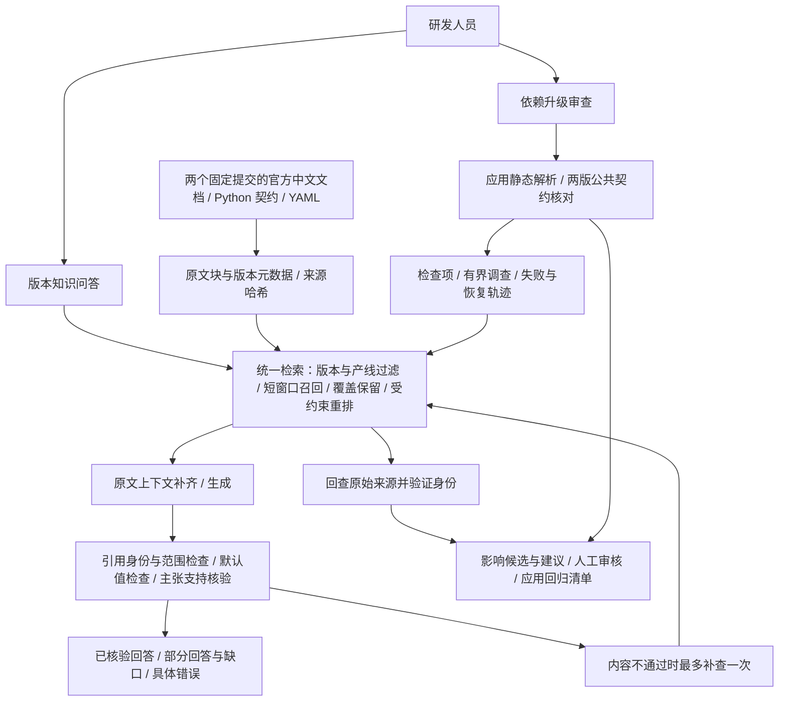

# PaddleOCR 版本知识与应用升级审查：面试演示包

本版面向维护扫描文档处理应用的研发人员：平时查询固定依赖版本的接口、参数和结果格式；升级时检查应用调用位置与结果消费方式，整理证据和验证清单，由研发人员确认。知识源是官方公开资料，应用是原创样例，不能表述为客户内部上线项目。

## 90 秒介绍

我做的是文档处理应用的依赖升级助手，重点解决 PaddleOCR 2.9.1 到 3.0.0 升级时，接口和结果格式变化影响业务代码的问题。一个统一知识层支持日常问答，也给审查流程提供证据。

RAG 收录两个固定提交的中文文档、公共 Python 契约和 YAML 配置，共 58 条来源、1754 个原文块。文档表格和代码容易被切散，同名参数又分属不同产线，所以我先按版本和产线限定范围，再用短窗口召回，补齐同一原文的表头和代码上下文。比较了 BM25、神经重排、融合召回与受约束模型重排，保留可复核的实验结果，选型优先考虑事实覆盖，而不是几毫秒的差异。

审查采用受控流程：静态解析应用调用和结果消费位置，核对两版官方契约，针对检查项调用同一 RAG 查证，给出风险和缺口，最后人工确认。检索候选和模型建议都不能改写静态风险结论，也不能把没有执行过的应用宣布为兼容。它是窄范围的工程原型，不是全自动任意项目迁移工具。

## 架构

## 演示一：成功查询

输入：**OCR 产线 v3.0.0 的 cpu_threads 默认值是多少？**

预期：返回默认值 **8**，引用目标版本 OCR 产线的原文。打开来源检查参数表，不只看模型说法。真实调用记录在 [live-report.json](../evaluation/paddleocr_quality_v4/final/live-report.json)。不要以这一个正确回答证明所有问题都准确。

接着审查 `examples/paddleocr_document_app/removed_structure_api.py`，选择 2.9.1 → 3.0.0。展示调用位置、两版官方证据、`PPStructure` 的迁移风险，以及人工验证要求。基础调用未发现已支持风险时仍不能宣布结果契约兼容。

更深入追问时展示原创应用回归：旧结果消费在旧版可运行，在新版触发 `IndexError`；适配器对两页中文样例与一页空白页的回归通过。记录是历史真实执行结果，不是本次公网运行结果，也不是 OCR 识别准确率。

## 演示二：真实失败与边界

开发题 `v4-03`：**OCR 产线 predict 返回结果后怎么逐个打印并保存图片？**

冻结实验中 Top-5 没有完整包含所需代码事实；这是复合问题的证据覆盖不足，不是 API 余额不足，也不能归因于基础模型一定不会回答。即使线上某次回答成功，也不能覆盖或删除这个失败记录。保留已有可核验内容、明确缺口，必要时由用户核对完整官方代码样例。

留出题 `v4-14` 的全部角度分类值也没有完整覆盖。没有添加这两道题专用规则。后续需要新的独立测试问题验证改进，不能拿已经看过的留出题继续选参数。

## 可引用的数字

| 证据 | 实际结果 | 不能据此声称 |
|---|---|---|
| 开发题，12 条 | 原始 BM25 完整事实覆盖 9/12；范围窗口 BM25 10/12；受约束模型重排 11/12 | 生产答案准确率 91.7% |
| 按产线分组留出题，8 条 | 原始 BM25 5/8；范围窗口 BM25 与模型重排均 7/8 | 模型重排在新问题上显著优于 BM25 |
| 实际模型调用，5 次 | 17.6–40.5 秒；供应商报告合计 67119 Token；1 次补查 | P95、每次固定成本、零幻觉或独立人工验收 |
| 本次发布回归 | 服务 441 passed / 1 skipped；UI 173 passed / 10 skipped；Agent 相关检查 38 passed | 652 条真实用户任务全部完成 |

测试标签由开发者依据原文标注，规模有限；生成和支持核验使用同一模型，可能共享偏差。Agent 本轮共用改进后的检索入口，但没有新的端到端成功率结论。

## 面试官常追问

- **为什么用这套语料？** 同一真实依赖有官方中文资料、两版公共接口、代码契约和参数配置，能验证升级风险。只收录与当前应用相关的范围，不宣称收录整个公司研发资料。
- **为什么不用纯向量 / 为什么不是 RRF？** API 名、字段、版本是精确标识；同时存在中文描述和代码。保留 BM25 基线，通过固定问题比较完整事实覆盖。此次 RRF+BGE 开发题 10/12，未胜过暂选模型重排；比较配置存在窗口差异，不是纯模型单变量实验。
- **为什么叫 Agent？** 它是有界工具调查与建议生成，不是开放自主执行。确定性静态风险规则不需要 LLM；调查和建议在受控流程内补足自然语言证据。不要声称必须用全自主 Agent 才能实现。
- **检索和回答怎么区别？** 召回资料只是候选；引用 ID 可追溯不等于每句有原文支持。身份、版本、模块、默认值及主张分别检查，内容不通过最多补查一次；服务故障报告具体错误，保留可用证据。
- **为什么能接受几十秒？** 用户是内部研发，升级决策更重视漏查与误判；过程显示阶段与耗时，不给未经统计的虚假 ETA。检索时间和模型时间分开记录。
- **安全边界？** 不执行上传代码，不自动写回，不伪造运行验证；版本范围、来源身份、轮数、时间和工具错误受后端约束。匿名演示不等于已实现企业 SSO、RBAC、多租户隔离与生产 SLA。
- **还有哪些短板？** 小规模自标注评测、复合问题覆盖不足、核验同模型偏差；扩大候选池后模型仍只排序前 40 窗口。下一步优先新增独立业务题和人工主张审查，避免继续调已看过的留出题。

## 演示前检查

确认公网前后端是同一发布版本，后端 `rag_quality_evaluation` 有效且策略为 `contextual_llm_rerank`。仓库的离线结果与公开服务检查分开记录；只有核实公网后，才说“已发布”。模型权重和企业权限不属于匿名演示已部署能力。

项目介绍、实验表和失败项到这里即可投递；把时间转向能解释代码、复现失败和讲清工程取舍，不再换场景扩范围。
